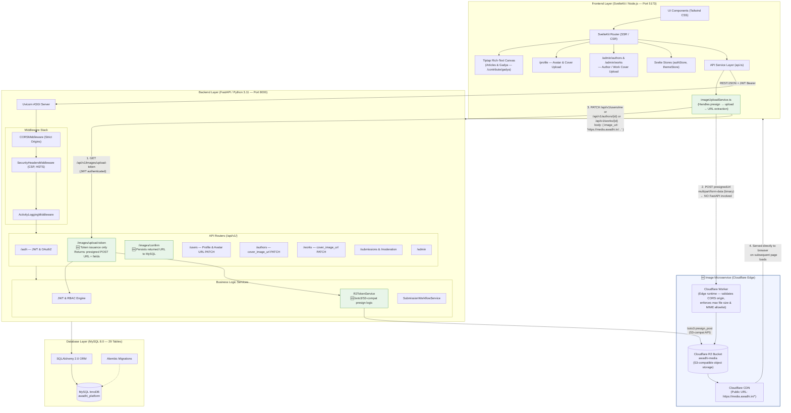
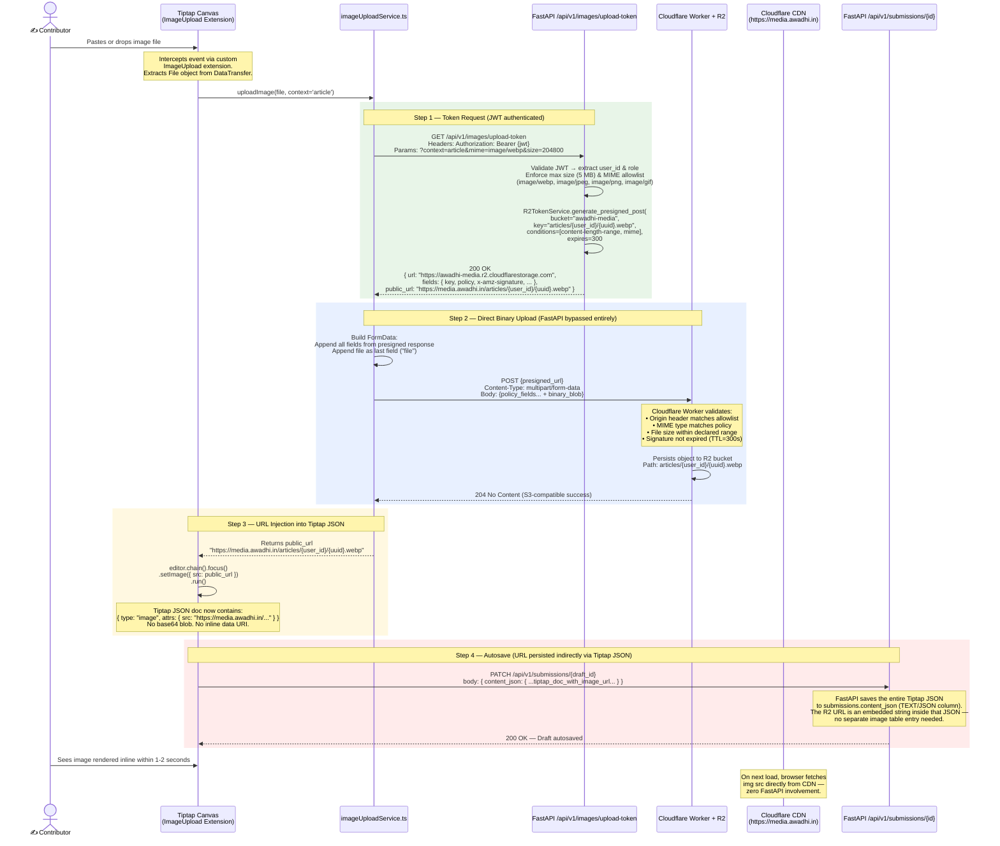
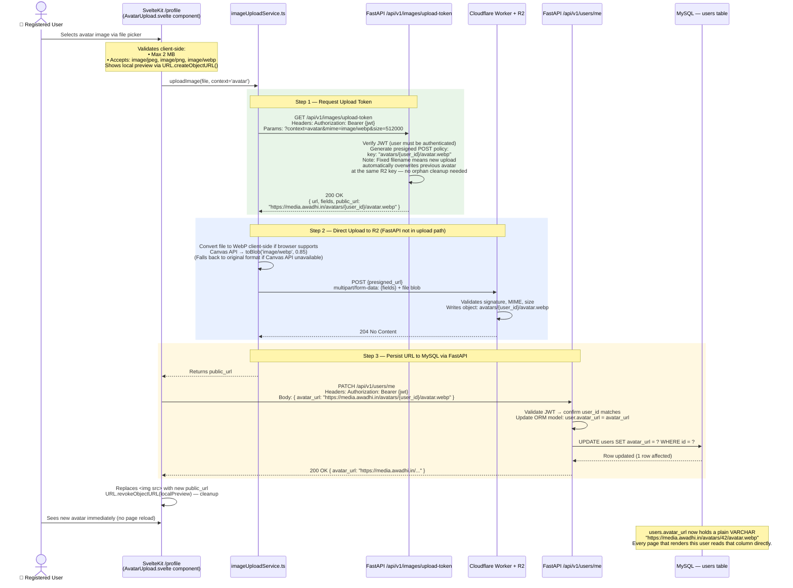
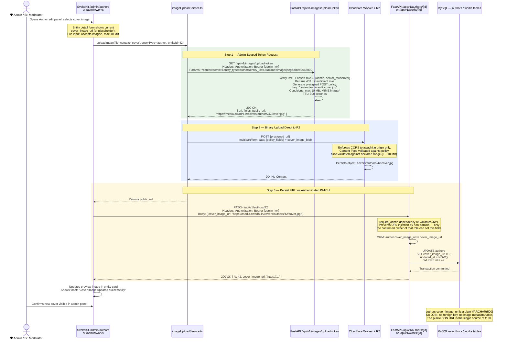
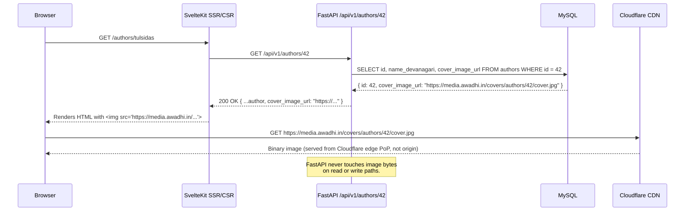
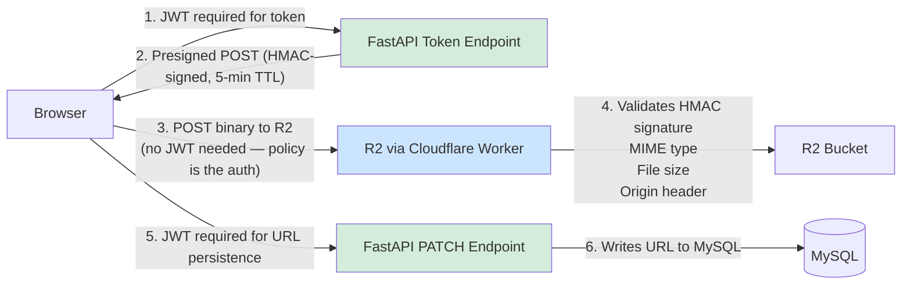

# Architectural Audit — Awadhi Literature Platform v5.0
## Section 1: System & Data Flow Map — Decoupled Image Microservice

**Document Status:** Implementation-Ready Draft  
**Scope:** Cloudflare Worker + R2 image upload integration as a sidecar to the existing SvelteKit → FastAPI → MySQL stack  
**Prepared For:** Infrastructure Lead review; covers topology, three upload flows, URL lifecycle, and architectural rationale

---

## A. Macro Architecture Addition

### A.1 Positioning the Image Microservice

The image upload microservice is a **fully decoupled sidecar** that sits alongside the existing application stack. It is not a new internal FastAPI module — it is an external Cloudflare Worker deployed to Cloudflare's global edge network. Its responsibilities are narrow and strictly bounded:

| Responsibility | Owner |
|:---|:---|
| Issue time-limited, scoped upload tokens (presigned POST policies) | FastAPI `/api/v1/images/upload-token` |
| Accept the binary image payload and persist it to R2 | Cloudflare Worker + R2 Bucket |
| Store the returned public R2 URL as a plain `VARCHAR` string | FastAPI → MySQL |
| Serve the image to end users on subsequent requests | Cloudflare CDN (R2 public bucket URL) |

The FastAPI backend **never receives, buffers, or proxies the binary image bytes.** Its only role in the upload path is JWT-authenticated token issuance. The SvelteKit frontend directly `POST`s the binary file to R2 using the presigned URL.

---

### A.2 Complete Updated System Topology



> **Legend:** 🆕 = net-new component added by this feature. Everything else is pre-existing v5.0 infrastructure.

---

## B. Three Separate Data Flow Sequences

### B.1 — Tiptap Editor Image Upload Flow

**Trigger:** User pastes an image (`paste` event) or drops a file (`drop` event) onto the Tiptap canvas at `/contribute/gadya` or `/contribute/article`.

**Tiptap Extension:** A custom `ImageUpload` Tiptap extension intercepts the browser event, preventing Tiptap's default inline-base64 embedding.



---

### B.2 — User Avatar / Profile Image Upload Flow

**Trigger:** User navigates to `/profile`, clicks "Change Avatar" or "Change Cover Photo", selects a file via `<input type="file">`.



---

### B.3 — Admin Author / Work Cover Upload Flow

**Trigger:** Admin navigates to `/admin/authors` or `/admin/works`, opens an entity's edit panel, and uploads a cover image.

**Security context:** Requires `role = admin` or `role = senior_moderator`. RBAC enforced by FastAPI dependency injection (`require_admin` guard on the token endpoint and the PATCH endpoint).



---

## C. URL Lifecycle

### C.1 The Complete Journey of One URL

```
"https://media.awadhi.in/avatars/42/avatar.webp"
```

| Phase | What Happens | Where |
|:---|:---|:---|
| **1. Generation** | `R2TokenService.generate_presigned_post()` computes the deterministic public URL from the bucket name + object key. The URL is returned to the client in the token response *before* the file is even uploaded. | FastAPI — `R2TokenService` |
| **2. Object Creation** | Client uploads binary to R2 via presigned POST. R2 creates the object at the declared key. The public URL is now resolvable. | Cloudflare R2 Bucket |
| **3. Persistence** | Client sends the URL as a plain string in a JSON body to FastAPI. FastAPI writes it to MySQL via SQLAlchemy ORM. No image metadata, no file size, no EXIF — just the URL string. | FastAPI → MySQL `VARCHAR(500)` |
| **4. CDN Serving** | On all subsequent page loads, the client receives the URL from the API response and sets it as ``. The browser fetches the image directly from Cloudflare's CDN. FastAPI is not in this path at all. | Cloudflare CDN → Browser |
| **5. Cache** | Cloudflare's edge network caches the image globally. `Cache-Control: public, max-age=31536000, immutable` is set on R2 objects. Deterministic file paths (e.g. `avatar.webp`) are busted by uploading a new file to the same key. | Cloudflare Edge PoPs |

### C.2 MySQL Storage — Column Reality

```sql
-- No new table is created. The URL drops into existing columns:

-- users table (already exists, column added via Alembic migration)
ALTER TABLE users
  ADD COLUMN avatar_url VARCHAR(500) NULL,
  ADD COLUMN cover_image_url VARCHAR(500) NULL;

-- authors table (already exists)
ALTER TABLE authors
  ADD COLUMN cover_image_url VARCHAR(500) NULL;

-- works table (already exists)
ALTER TABLE works
  ADD COLUMN cover_image_url VARCHAR(500) NULL;

-- submissions table: content_json (TEXT) already stores the
-- full Tiptap JSON document. The R2 URL lives embedded in that
-- JSON as an image node's `src` attribute. No column change needed
-- for Tiptap editor images.
```

> [!IMPORTANT]
> **No foreign key. No image metadata table. No file-size column.** The R2 URL is treated identically to how a CMS like WordPress stores an `_wp_attachment_url` post meta: a plain string that the CDN resolves. This is intentional (see §D).

### C.3 Page Load — Read Path (Zero Image Overhead on FastAPI)



---

## D. Key Architectural Decisions

### D.1 Why Binary Payloads Bypass FastAPI

**The core problem with naïve image upload via FastAPI:**

```python
# What we are NOT doing — Anti-pattern
@router.post("/upload-image")
async def upload_image(file: UploadFile = File(...)):
    contents = await file.read()  # Entire binary blob into Python heap
    # Blocks Uvicorn worker thread during I/O
    # Doubles bandwidth (client → server → R2)
    # Memory spike per concurrent upload
    s3_client.put_object(Body=contents, ...)
```

This approach means:
- Every 5 MB avatar upload allocates 5 MB of RAM inside the Uvicorn ASGI worker.
- With 20 concurrent uploads, that's 100 MB of heap pressure on the Python process.
- The binary is transmitted twice: client → FastAPI → R2. Double egress cost.
- Uvicorn's default worker count is CPU-bound; blocking on large I/O starves API calls.

**The presigned-POST solution:**

```
Client ──(JWT)──► FastAPI ──► [generates 300-byte JSON token] ──► Client
Client ──(5MB binary)──────────────────────────────────────────► R2 directly
```

FastAPI's involvement is `O(1)` per upload: one tiny JSON payload, no binary I/O, no memory pressure. The binary transfer is offloaded entirely to Cloudflare's infrastructure.

---

### D.2 FastAPI's Role: Token Issuance Only

The `R2TokenService` has exactly one job in the upload path:

```python
# backend/app/services/r2_token_service.py (to be created)
import boto3
from botocore.client import Config
from app.core.settings import settings

class R2TokenService:
    def __init__(self):
        self._client = boto3.client(
            "s3",
            endpoint_url=settings.R2_ENDPOINT_URL,         # https://{account_id}.r2.cloudflarestorage.com
            aws_access_key_id=settings.R2_ACCESS_KEY_ID,
            aws_secret_access_key=settings.R2_SECRET_ACCESS_KEY,
            config=Config(signature_version="s3v4"),
            region_name="auto",
        )

    def generate_presigned_post(
        self,
        key: str,
        mime_type: str,
        max_size_bytes: int,
        expires_in: int = 300,
    ) -> dict:
        """
        Returns a presigned POST URL + policy fields.
        The client uses these to upload directly to R2.
        FastAPI never sees the binary payload.
        """
        return self._client.generate_presigned_post(
            Bucket=settings.R2_BUCKET_NAME,
            Key=key,
            Fields={"Content-Type": mime_type},
            Conditions=[
                {"Content-Type": mime_type},
                ["content-length-range", 1, max_size_bytes],
            ],
            ExpiresIn=expires_in,
        )
```

The endpoint that calls this service is intentionally thin:

```python
# GET /api/v1/images/upload-token
@router.get("/images/upload-token")
async def get_upload_token(
    context: Literal["article", "avatar", "cover"],
    mime: str,
    size: int,
    current_user: User = Depends(get_current_user),
    r2: R2TokenService = Depends(get_r2_service),
):
    # 1. Validate MIME allowlist
    # 2. Validate max size per context
    # 3. Build deterministic key (e.g. avatars/{user_id}/avatar.webp)
    # 4. Call R2TokenService → return presigned data
    # FastAPI's work ends here. ~5ms total.
    ...
```

---

### D.3 Why This Keeps the Database Lightweight

| Design Choice | Alternative | Why Avoided |
|:---|:---|:---|
| Store URL as `VARCHAR(500)` in existing table column | Separate `images` metadata table with FK | FK table would require JOIN on every author/user query. Images don't need relational integrity — if an R2 object is deleted, the URL becomes a 404, which is acceptable and observable. |
| Deterministic, fixed-path keys (`avatars/{user_id}/avatar.webp`) | UUID per upload, stored in DB | Fixed paths make overwrites implicit — uploading a new avatar automatically replaces the old one at the same CDN URL. No orphan-cleanup cron needed. No URL update query needed (URL is stable). |
| No EXIF/metadata stored in MySQL | Store width, height, format, file size in DB | The platform's use-cases don't need image metadata for rendering decisions. The CDN serves the image; the browser's `` tag handles layout. Storing metadata adds schema surface area for zero functional benefit at current scale. |
| Tiptap images embedded as URL strings in `content_json` | Separate junction table `submission_images(submission_id, image_url)` | Junction table would require separate migration and query. The Tiptap JSON document is already the ground truth for article content. The URL is just another attribute of an image node within that document. |

---

### D.4 Security Boundaries



**Threat mitigations:**

| Threat | Mitigation |
|:---|:---|
| Unauthenticated upload token request | Token endpoint requires valid JWT (`get_current_user` dependency) |
| Token replay attack | Presigned POST policy has 5-minute TTL; HMAC signature is single-use-scoped |
| Uploading to arbitrary R2 keys | Key is constructed server-side from `user_id` + `context`; client cannot influence the path |
| Injecting arbitrary URLs into user/author records | PATCH endpoints require JWT; the `image_url` field is validated to match the platform's R2 public URL prefix (`https://media.awadhi.in/`) |
| Storing malicious file content | Cloudflare Worker enforces MIME allowlist; R2 does not execute stored content |
| Cross-origin token abuse | Cloudflare Worker checks `Origin` header against the platform's domain allowlist |

---

## Appendix: New Environment Variables Required

```bash
# backend/.env additions
R2_ENDPOINT_URL=https://{CF_ACCOUNT_ID}.r2.cloudflarestorage.com
R2_ACCESS_KEY_ID=<r2_api_token_key_id>
R2_SECRET_ACCESS_KEY=<r2_api_token_secret>
R2_BUCKET_NAME=awadhi-media
R2_PUBLIC_URL_BASE=https://media.awadhi.in

# frontend/.env additions
PUBLIC_IMAGE_UPLOAD_CONTEXT_ARTICLE=article
PUBLIC_IMAGE_UPLOAD_CONTEXT_AVATAR=avatar
PUBLIC_IMAGE_UPLOAD_CONTEXT_COVER=cover
```

## Appendix: Schema Migrations Required

```
SCHEMA CHANGE
Table(s):     users
Change:       Add columns avatar_url VARCHAR(500) NULL,
              cover_image_url VARCHAR(500) NULL
Reason:       Store Cloudflare R2 public URLs for user profile images
Migration:    alembic/versions/<rev>_add_user_image_urls.py
Reversible:   Yes (downgrade drops both columns)

SCHEMA CHANGE
Table(s):     authors
Change:       Add column cover_image_url VARCHAR(500) NULL
Reason:       Store Cloudflare R2 public URL for author cover art
Migration:    alembic/versions/<rev>_add_author_cover_image_url.py
Reversible:   Yes

SCHEMA CHANGE
Table(s):     works
Change:       Add column cover_image_url VARCHAR(500) NULL
Reason:       Store Cloudflare R2 public URL for work cover art
Migration:    alembic/versions/<rev>_add_work_cover_image_url.py
Reversible:   Yes
```

> [!NOTE]
> Tiptap article images require **zero schema migrations** — the R2 URL embeds naturally inside the existing `submissions.content_json` TEXT column as part of the Tiptap document node tree.
