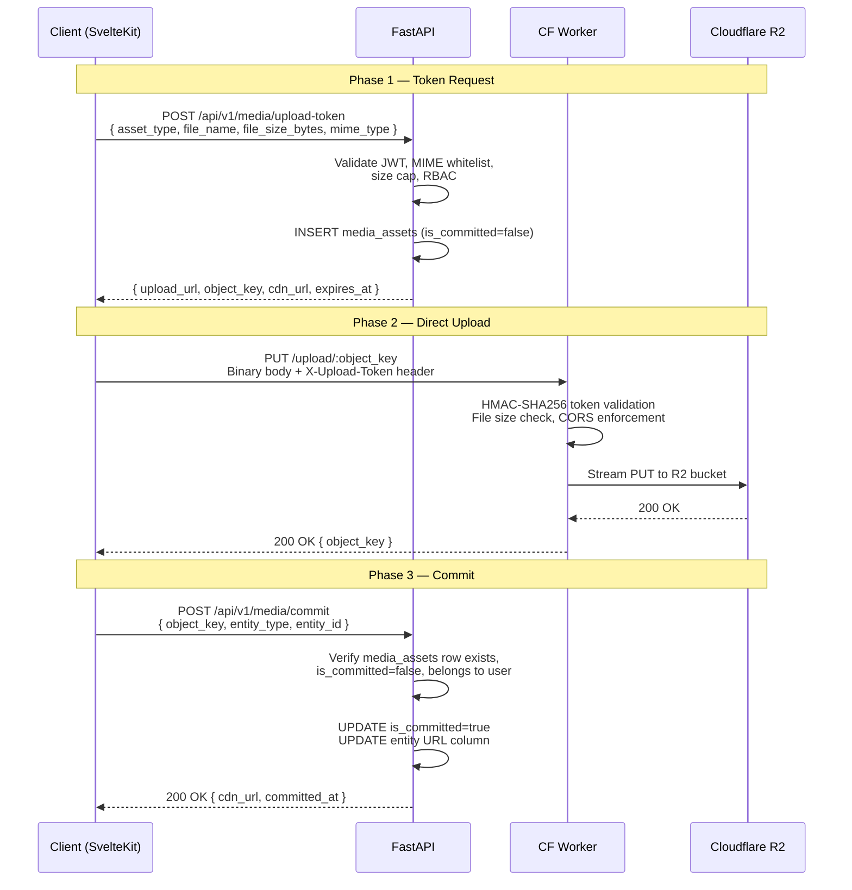

# Section 3: API & Integration Strategy
### Awadhi Literature Platform — Decoupled Image Upload Microservice

> [!IMPORTANT]
> This section describes the **Presigned URL Pattern** for client-direct R2 uploads. The FastAPI application server never receives binary file data — it only orchestrates tokens and commits metadata. This is the critical architectural invariant that eliminates memory pressure and scales independently of the main API.

---

## A. The Three-Phase Upload Protocol



---

### Phase 1 — Token Request: `POST /api/v1/media/upload-token`

**Auth:** `Authorization: Bearer <JWT>`  
**Rate Limit:** Apply `app/services/rate_limit.py` — suggested 20 req/min per user.

#### Request Schema

```python
# backend/app/schemas/media.py

from pydantic import BaseModel, field_validator, model_validator
from enum import Enum

class AssetType(str, Enum):
    ARTICLE_COVER     = "article_cover"
    AUTHOR_AVATAR     = "author_avatar"
    ARTICLE_INLINE    = "article_inline"   # Tiptap inline image
    POET_PORTRAIT     = "poet_portrait"
    COLLECTION_COVER  = "collection_cover"

MIME_WHITELIST: set[str] = {
    "image/jpeg",
    "image/png",
    "image/webp",
    "image/gif",
    "image/svg+xml",
}

# Per-asset-type size caps (bytes)
SIZE_CAPS: dict[AssetType, int] = {
    AssetType.ARTICLE_COVER:    10 * 1024 * 1024,   # 10 MB
    AssetType.AUTHOR_AVATAR:     2 * 1024 * 1024,   #  2 MB
    AssetType.ARTICLE_INLINE:    5 * 1024 * 1024,   #  5 MB
    AssetType.POET_PORTRAIT:     5 * 1024 * 1024,   #  5 MB
    AssetType.COLLECTION_COVER: 10 * 1024 * 1024,   # 10 MB
}

class UploadTokenRequest(BaseModel):
    asset_type:       AssetType
    file_name:        str
    file_size_bytes:  int
    mime_type:        str

    @field_validator("mime_type")
    @classmethod
    def validate_mime(cls, v: str) -> str:
        if v not in MIME_WHITELIST:
            raise ValueError(f"MIME type '{v}' is not permitted. Allowed: {MIME_WHITELIST}")
        return v

    @model_validator(mode="after")
    def validate_size_cap(self) -> "UploadTokenRequest":
        cap = SIZE_CAPS.get(self.asset_type)
        if cap and self.file_size_bytes > cap:
            raise ValueError(
                f"File size {self.file_size_bytes} bytes exceeds the "
                f"{cap // (1024*1024)} MB limit for asset_type '{self.asset_type}'."
            )
        if self.file_size_bytes <= 0:
            raise ValueError("file_size_bytes must be a positive integer.")
        return self
```

#### Response Schema

```python
# backend/app/schemas/media.py (continued)

from datetime import datetime

class UploadTokenResponse(BaseModel):
    upload_url:  str          # Cloudflare Worker PUT endpoint (time-limited)
    object_key:  str          # R2 object path, e.g. "uploads/avatars/uuid-filename.webp"
    cdn_url:     str          # Final public CDN URL (usable immediately after Phase 2)
    expires_at:  datetime     # Token expiry (15 min from issuance)
```

#### Endpoint Implementation

```python
# backend/app/api/v1/media.py

import hashlib
import hmac
import secrets
import time
from datetime import datetime, timedelta, timezone
from pathlib import Path

from fastapi import APIRouter, Depends, status
from sqlalchemy.ext.asyncio import AsyncSession

from app.core.activity_logger import log_activity
from app.core.auth import get_current_user
from app.core.permissions import role_at_least
from app.core.settings import settings
from app.db.session import get_db
from app.models.media_asset import MediaAsset
from app.schemas.media import UploadTokenRequest, UploadTokenResponse
from app.services.rate_limit import rate_limit

router = APIRouter(prefix="/media", tags=["media"])

TOKEN_EXPIRY_SECONDS = 900  # 15 minutes

def _generate_object_key(asset_type: str, file_name: str) -> str:
    """Construct a deterministic, collision-resistant R2 object key."""
    ext = Path(file_name).suffix.lower()
    uid = secrets.token_urlsafe(16)
    return f"uploads/{asset_type}/{uid}{ext}"

def _sign_upload_token(object_key: str, expires_at: int) -> str:
    """HMAC-SHA256 token for the Cloudflare Worker to validate."""
    payload = f"{object_key}:{expires_at}"
    return hmac.new(
        settings.WORKER_HMAC_SECRET.encode(),
        payload.encode(),
        hashlib.sha256,
    ).hexdigest()

@router.post(
    "/upload-token",
    response_model=UploadTokenResponse,
    status_code=status.HTTP_200_OK,
)
async def request_upload_token(
    body: UploadTokenRequest,
    db: AsyncSession = Depends(get_db),
    current_user=Depends(get_current_user),
    _rl=Depends(rate_limit(key="upload-token", max_per_minute=20)),
):
    # §11 of FastAPI standards: permission check before any business logic
    role_at_least(current_user, required_role="contributor")

    expires_ts = int(time.time()) + TOKEN_EXPIRY_SECONDS
    expires_at = datetime.fromtimestamp(expires_ts, tz=timezone.utc)
    object_key = _generate_object_key(body.asset_type, body.file_name)
    token = _sign_upload_token(object_key, expires_ts)

    cdn_url = f"{settings.CDN_BASE_URL}/{object_key}"
    upload_url = (
        f"{settings.WORKER_BASE_URL}/upload/{object_key}"
        f"?expires={expires_ts}&token={token}"
    )

    # Persist uncommitted asset row
    asset = MediaAsset(
        object_key=object_key,
        asset_type=body.asset_type,
        mime_type=body.mime_type,
        file_size_bytes=body.file_size_bytes,
        cdn_url=cdn_url,
        uploaded_by=current_user.id,
        is_committed=False,
        expires_at=expires_at,
    )
    db.add(asset)
    await db.commit()

    # §8: audit log on every mutating endpoint
    await log_activity(
        db,
        actor_id=current_user.id,
        action="media.upload_token_issued",
        detail={"object_key": object_key, "asset_type": body.asset_type},
    )

    return UploadTokenResponse(
        upload_url=upload_url,
        object_key=object_key,
        cdn_url=cdn_url,
        expires_at=expires_at,
    )
```

#### `media_assets` Table Schema (Alembic Migration)

> [!NOTE]
> Schema change announcement per §12 of FastAPI standards. The migration below adds a new `media_assets` table. It touches no existing tables.

```sql
-- Alembic-generated: add_media_assets_table
CREATE TABLE media_assets (
    id               BIGINT        NOT NULL AUTO_INCREMENT PRIMARY KEY,
    object_key       VARCHAR(512)  NOT NULL UNIQUE,
    asset_type       VARCHAR(64)   NOT NULL,
    mime_type        VARCHAR(128)  NOT NULL,
    file_size_bytes  INT           NOT NULL,
    cdn_url          VARCHAR(1024) NOT NULL,
    uploaded_by      BIGINT        NOT NULL,
    is_committed     TINYINT(1)    NOT NULL DEFAULT 0,
    expires_at       DATETIME      NOT NULL,
    committed_at     DATETIME      NULL,
    entity_type      VARCHAR(64)   NULL,
    entity_id        BIGINT        NULL,
    created_at       DATETIME      NOT NULL DEFAULT CURRENT_TIMESTAMP,

    INDEX idx_uploaded_by     (uploaded_by),
    INDEX idx_is_committed    (is_committed),
    INDEX idx_expires_at      (expires_at),
    CONSTRAINT fk_media_uploaded_by
        FOREIGN KEY (uploaded_by) REFERENCES users(id) ON DELETE CASCADE
) ENGINE=InnoDB DEFAULT CHARSET=utf8mb4 COLLATE=utf8mb4_unicode_ci;
```

**Garbage Collection Strategy:** A scheduled task (future Celery/arq job, per §7 of FastAPI standards) should `DELETE FROM media_assets WHERE is_committed = 0 AND expires_at < NOW()` and call the R2 API to purge the corresponding objects. Write the cleanup as a plain callable `purge_expired_assets(db)` so the job queue addition is a one-liner.

---

### Phase 2 — Direct Upload (Client → Cloudflare Worker → R2)

The client sends a `PUT` request directly to the Cloudflare Worker endpoint. The FastAPI server is completely out of this data path.

**Request:**
```
PUT https://media-worker.awadhi.workers.dev/upload/{object_key}?expires={ts}&token={hmac}
Headers:
  Content-Type:   image/webp
  Content-Length: 1048576
  X-Upload-Token: <hmac_hex>
Body: <binary file content>
```

**Success Response:**
```json
HTTP 200 OK
{ "object_key": "uploads/article_inline/abc123.webp", "bytes_written": 1048576 }
```

**Failure Responses:**

| Condition | Status | Body |
|---|---|---|
| Token expired or invalid HMAC | `401` | `{ "error": "invalid_token" }` |
| File size exceeds declared `file_size_bytes` | `413` | `{ "error": "payload_too_large" }` |
| CORS origin not in allowlist | `403` | `{ "error": "cors_rejected" }` |
| R2 write failure | `502` | `{ "error": "storage_unavailable" }` |

---

### Phase 3 — Commit: `POST /api/v1/media/commit`

**Auth:** `Authorization: Bearer <JWT>` (same user who requested the token)

#### Request & Response Schema

```python
# backend/app/schemas/media.py (continued)

class EntityType(str, Enum):
    ARTICLE    = "article"
    POET       = "poet"
    AUTHOR     = "author"
    COLLECTION = "collection"

class CommitAssetRequest(BaseModel):
    object_key:  str
    entity_type: EntityType
    entity_id:   int

class CommitAssetResponse(BaseModel):
    cdn_url:      str
    committed_at: datetime
```

#### Endpoint Implementation

```python
# backend/app/api/v1/media.py (continued)

from app.services.media_service import MediaCommitService

@router.post(
    "/commit",
    response_model=CommitAssetResponse,
    status_code=status.HTTP_200_OK,
)
async def commit_asset(
    body: CommitAssetRequest,
    db: AsyncSession = Depends(get_db),
    current_user=Depends(get_current_user),
):
    # Delegate to service layer — routes call service, never ORM directly
    result = await MediaCommitService(db).commit(
        object_key=body.object_key,
        entity_type=body.entity_type,
        entity_id=body.entity_id,
        actor=current_user,
    )
    await log_activity(
        db,
        actor_id=current_user.id,
        action="media.asset_committed",
        detail={
            "object_key": body.object_key,
            "entity_type": body.entity_type,
            "entity_id": body.entity_id,
        },
    )
    return result
```

```python
# backend/app/services/media_service.py

from datetime import datetime, timezone
from fastapi import HTTPException, status
from sqlalchemy import select, update
from sqlalchemy.ext.asyncio import AsyncSession

from app.models.media_asset import MediaAsset
from app.schemas.media import CommitAssetResponse, EntityType

ENTITY_URL_COLUMNS: dict[EntityType, tuple[str, str]] = {
    EntityType.ARTICLE:    ("articles",    "cover_image_url"),
    EntityType.POET:       ("poets",       "portrait_url"),
    EntityType.AUTHOR:     ("authors",     "avatar_url"),
    EntityType.COLLECTION: ("collections", "cover_url"),
}

class MediaCommitService:
    def __init__(self, db: AsyncSession):
        self.db = db

    async def commit(
        self,
        object_key: str,
        entity_type: EntityType,
        entity_id: int,
        actor,
    ) -> CommitAssetResponse:
        # Fetch the pending asset row
        result = await self.db.execute(
            select(MediaAsset).where(MediaAsset.object_key == object_key)
        )
        asset: MediaAsset | None = result.scalar_one_or_none()

        if asset is None:
            raise HTTPException(status.HTTP_404_NOT_FOUND, "Asset not found.")
        if asset.uploaded_by != actor.id:
            raise HTTPException(status.HTTP_403_FORBIDDEN, "Asset belongs to another user.")
        if asset.is_committed:
            raise HTTPException(status.HTTP_409_CONFLICT, "Asset already committed.")
        if asset.expires_at < datetime.now(tz=timezone.utc):
            raise HTTPException(status.HTTP_410_GONE, "Upload token has expired.")

        committed_at = datetime.now(tz=timezone.utc)

        # Flip the asset row
        await self.db.execute(
            update(MediaAsset)
            .where(MediaAsset.id == asset.id)
            .values(
                is_committed=True,
                committed_at=committed_at,
                entity_type=entity_type,
                entity_id=entity_id,
            )
        )

        # Update the target entity's URL column
        table, column = ENTITY_URL_COLUMNS[entity_type]
        # Raw SQL preferred here: avoids loading entity ORM object just to update one column
        await self.db.execute(
            f"UPDATE {table} SET {column} = :url WHERE id = :eid",  # noqa: S608
            {"url": asset.cdn_url, "eid": entity_id},
        )

        await self.db.commit()
        return CommitAssetResponse(cdn_url=asset.cdn_url, committed_at=committed_at)
```

---

## B. Tiptap-Specific Integration

### Why Tiptap Articles Skip Phase 3

When a user uploads an image inline within a Tiptap editor, the `cdn_url` returned from Phase 2 is **immediately embedded into the Tiptap JSON document** as an `<image src="...">` node attribute. When the article is saved, the entire Tiptap JSON is persisted to the `articles.tiptap_content` column — the image URL travels with the document.

There is no separate "entity URL column" to update, so Phase 3 is **unnecessary and must not be called** for `asset_type = "article_inline"`. The `media_assets` row will have `is_committed = false` permanently; it is considered committed by virtue of the document save. The garbage collection job must **not** purge rows whose `object_key` appears in any article's `tiptap_content` JSON (cross-reference check required before deletion).

### Custom Tiptap Image Extension

```typescript
// frontend/src/lib/editor/extensions/AwadImageExtension.ts

import Image from "@tiptap/extension-image";
import type { Editor } from "@tiptap/core";
import { uploadImage } from "$lib/services/media";

export const AwadImageExtension = Image.extend({
  name: "awadImage",

  addAttributes() {
    return {
      ...this.parent?.(),
      // Track upload state for optimistic UI
      "data-upload-state": {
        default: null,
        parseHTML: () => null,            // never serialised to JSON
        renderHTML: (attrs) => ({
          "data-upload-state": attrs["data-upload-state"],
        }),
      },
    };
  },

  addProseMirrorPlugins() {
    return [
      // Drop handler: triggers Phase 1 → 2 flow on image drop/paste
      buildImageDropPlugin(this.editor),
    ];
  },
});

/**
 * Called by the drop/paste plugin. Runs Phase 1 → 2 and inserts the node.
 * Phase 3 is intentionally omitted for inline article images.
 */
export async function handleInlineImageUpload(
  file: File,
  editor: Editor,
): Promise<void> {
  // Insert placeholder with loading state
  const placeholderSrc = URL.createObjectURL(file);
  editor.commands.setImage({
    src: placeholderSrc,
    "data-upload-state": "uploading",
  } as any);

  try {
    // uploadImage orchestrates Phase 1 + Phase 2 only (no commit for inline)
    const { cdn_url } = await uploadImage(file, "article_inline");

    // Replace placeholder src with the permanent CDN URL
    // ProseMirror: find the placeholder node and update its attrs
    const { state, dispatch } = editor.view;
    const tr = state.tr;
    state.doc.descendants((node, pos) => {
      if (
        node.type.name === "awadImage" &&
        node.attrs.src === placeholderSrc
      ) {
        tr.setNodeMarkup(pos, undefined, {
          ...node.attrs,
          src: cdn_url,
          "data-upload-state": "done",
        });
      }
    });
    dispatch(tr);
  } catch (err) {
    // Remove placeholder on failure
    editor.commands.deleteSelection();
    throw err;
  } finally {
    URL.revokeObjectURL(placeholderSrc);
  }
}
```

### Tiptap Insert Command (non-inline, e.g. after Phase 3 for a cover image)

```typescript
// Used when inserting an image after a full Phase 1 → 2 → 3 flow (non-article-inline)
editor.chain().focus().setImage({ src: cdn_url }).run();
```

---

## C. Cloudflare Worker Spec

**Runtime:** Cloudflare Workers (TypeScript, ES2022 target)  
**Compatibility date:** `2024-09-23`

### `wrangler.toml`

```toml
name            = "awadhi-media-worker"
main            = "src/index.ts"
compatibility_date = "2024-09-23"

[[r2_buckets]]
binding  = "R2_BUCKET"
bucket_name = "awadhi-media"

[[kv_namespaces]]
binding    = "TOKEN_KV"
id         = "<your-kv-namespace-id>"

[vars]
CDN_BASE_URL    = "https://media.awadhi.in"
ALLOWED_ORIGINS = "https://awadhi.in,https://www.awadhi.in"
```

### Worker Implementation

```typescript
// worker/src/index.ts

export interface Env {
  R2_BUCKET:      R2Bucket;
  TOKEN_KV:       KVNamespace;
  HMAC_SECRET:    string;        // Bound as a secret via wrangler secret put
  CDN_BASE_URL:   string;
  ALLOWED_ORIGINS: string;
}

const ALLOWED_METHODS = ["PUT", "GET", "OPTIONS"];
const MAX_UPLOAD_BYTES = 10 * 1024 * 1024; // Global ceiling: 10 MB

export default {
  async fetch(request: Request, env: Env): Promise<Response> {
    const url = new URL(request.url);
    const origin = request.headers.get("Origin") ?? "";

    // CORS pre-flight
    if (request.method === "OPTIONS") {
      return corsResponse(new Response(null, { status: 204 }), origin, env);
    }

    if (!ALLOWED_METHODS.includes(request.method)) {
      return errorResponse(405, "method_not_allowed");
    }

    // Route: PUT /upload/:object_key
    if (request.method === "PUT" && url.pathname.startsWith("/upload/")) {
      return corsResponse(await handleUpload(request, url, env), origin, env);
    }

    // Route: GET /assets/:object_key
    if (request.method === "GET" && url.pathname.startsWith("/assets/")) {
      return corsResponse(await handleGet(url, env), origin, env);
    }

    return errorResponse(404, "not_found");
  },
};

// ---------------------------------------------------------------------------
// Upload handler
// ---------------------------------------------------------------------------
async function handleUpload(
  request: Request,
  url: URL,
  env: Env,
): Promise<Response> {
  const objectKey = decodeURIComponent(
    url.pathname.replace("/upload/", "")
  );

  // 1. Validate HMAC token from query params (put in URL at token-issuance time)
  const expiresParam = url.searchParams.get("expires");
  const tokenParam = url.searchParams.get("token");

  if (!expiresParam || !tokenParam) {
    return errorResponse(401, "missing_token");
  }

  const expires = parseInt(expiresParam, 10);
  if (Date.now() / 1000 > expires) {
    return errorResponse(401, "token_expired");
  }

  const expectedToken = await hmacSign(
    `${objectKey}:${expires}`,
    env.HMAC_SECRET,
  );

  if (!safeEqual(expectedToken, tokenParam)) {
    return errorResponse(401, "invalid_token");
  }

  // 2. Check Content-Length (enforced by global ceiling)
  const contentLength = parseInt(
    request.headers.get("Content-Length") ?? "0",
    10,
  );
  if (contentLength > MAX_UPLOAD_BYTES) {
    return errorResponse(413, "payload_too_large");
  }

  // 3. Stream PUT to R2
  try {
    await env.R2_BUCKET.put(objectKey, request.body, {
      httpMetadata: {
        contentType: request.headers.get("Content-Type") ?? "application/octet-stream",
      },
      customMetadata: {
        uploadedAt: new Date().toISOString(),
      },
    });
  } catch {
    return errorResponse(502, "storage_unavailable");
  }

  return new Response(
    JSON.stringify({ object_key: objectKey, bytes_written: contentLength }),
    { status: 200, headers: { "Content-Type": "application/json" } },
  );
}

// ---------------------------------------------------------------------------
// Asset GET handler (cache-friendly public serving)
// ---------------------------------------------------------------------------
async function handleGet(url: URL, env: Env): Promise<Response> {
  const objectKey = decodeURIComponent(
    url.pathname.replace("/assets/", "")
  );

  const object = await env.R2_BUCKET.get(objectKey);
  if (!object) return errorResponse(404, "not_found");

  const headers = new Headers();
  object.writeHttpMetadata(headers);
  headers.set("Cache-Control", "public, max-age=31536000, immutable");
  headers.set("ETag", object.httpEtag);

  return new Response(object.body, { headers });
}

// ---------------------------------------------------------------------------
// Helpers
// ---------------------------------------------------------------------------
async function hmacSign(payload: string, secret: string): Promise<string> {
  const key = await crypto.subtle.importKey(
    "raw",
    new TextEncoder().encode(secret),
    { name: "HMAC", hash: "SHA-256" },
    false,
    ["sign"],
  );
  const sig = await crypto.subtle.sign(
    "HMAC",
    key,
    new TextEncoder().encode(payload),
  );
  return Array.from(new Uint8Array(sig))
    .map((b) => b.toString(16).padStart(2, "0"))
    .join("");
}

/** Timing-safe string comparison */
function safeEqual(a: string, b: string): boolean {
  if (a.length !== b.length) return false;
  let result = 0;
  for (let i = 0; i < a.length; i++) {
    result |= a.charCodeAt(i) ^ b.charCodeAt(i);
  }
  return result === 0;
}

function errorResponse(status: number, code: string): Response {
  return new Response(JSON.stringify({ error: code }), {
    status,
    headers: { "Content-Type": "application/json" },
  });
}

function corsResponse(response: Response, origin: string, env: Env): Response {
  const allowed = env.ALLOWED_ORIGINS.split(",");
  if (!allowed.includes(origin)) return response;
  const headers = new Headers(response.headers);
  headers.set("Access-Control-Allow-Origin", origin);
  headers.set("Access-Control-Allow-Methods", ALLOWED_METHODS.join(", "));
  headers.set("Access-Control-Allow-Headers", "Content-Type, Content-Length, X-Upload-Token");
  headers.set("Vary", "Origin");
  return new Response(response.body, { status: response.status, headers });
}
```

---

## D. SvelteKit Frontend Service Functions

> [!IMPORTANT]
> Per §7 of the Svelte Frontend Standards: **all HTTP calls go through `src/lib/services/api.ts`**. Components never call `fetch` directly. The functions below live in `src/lib/services/media.ts` and use the shared `api` client for FastAPI calls. Direct R2 PUT bypasses `api.ts` (correct — it targets a different origin with no auth header).

### TypeScript Interfaces

```typescript
// frontend/src/lib/services/media.ts

import { api } from "./api";

// ── Response types mirroring FastAPI schemas ─────────────────────────────────

export interface UploadTokenRequest {
  asset_type: AssetType;
  file_name: string;
  file_size_bytes: number;
  mime_type: string;
}

export interface UploadTokenResponse {
  upload_url: string;
  object_key: string;
  cdn_url: string;
  expires_at: string; // ISO 8601
}

export interface CommitAssetRequest {
  object_key: string;
  entity_type: EntityType;
  entity_id: number;
}

export interface CommitAssetResponse {
  cdn_url: string;
  committed_at: string; // ISO 8601
}

export type AssetType =
  | "article_cover"
  | "author_avatar"
  | "article_inline"
  | "poet_portrait"
  | "collection_cover";

export type EntityType = "article" | "poet" | "author" | "collection";

// ── Service functions ─────────────────────────────────────────────────────────

/**
 * Phase 1: Request a time-limited upload token from FastAPI.
 * Returns presigned upload_url + permanent cdn_url.
 */
export async function requestUploadToken(
  payload: UploadTokenRequest,
): Promise<UploadTokenResponse> {
  return api.post<UploadTokenResponse>("/media/upload-token", payload);
}

/**
 * Phase 2: PUT binary file directly to the Cloudflare Worker.
 * Does NOT use the shared `api` client — different origin, no JWT header.
 * @throws {UploadError} with a `code` field matching the Worker error codes.
 */
export async function uploadToR2(
  uploadUrl: string,
  file: File,
  onProgress?: (percent: number) => void,
): Promise<void> {
  // Use XMLHttpRequest for progress tracking; fetch() has no upload progress API
  await new Promise<void>((resolve, reject) => {
    const xhr = new XMLHttpRequest();
    xhr.open("PUT", uploadUrl);
    xhr.setRequestHeader("Content-Type", file.type);
    xhr.setRequestHeader("Content-Length", String(file.size));

    if (onProgress) {
      xhr.upload.addEventListener("progress", (e) => {
        if (e.lengthComputable) onProgress(Math.round((e.loaded / e.total) * 100));
      });
    }

    xhr.onload = () => {
      if (xhr.status === 200) {
        resolve();
      } else {
        const body = tryParseJson(xhr.responseText);
        reject(new UploadError(xhr.status, body?.error ?? "unknown_error"));
      }
    };
    xhr.onerror = () => reject(new UploadError(0, "network_error"));
    xhr.send(file);
  });
}

/**
 * Phase 3: Tell FastAPI to flip is_committed and update the entity's URL column.
 * Must NOT be called for asset_type="article_inline" — see §B of the API strategy.
 */
export async function commitAsset(
  payload: CommitAssetRequest,
): Promise<CommitAssetResponse> {
  return api.post<CommitAssetResponse>("/media/commit", payload);
}

/**
 * Orchestrator: runs the full Phase 1 → 2 flow (→ 3 if entity context provided).
 *
 * For Tiptap inline images: pass no entityContext — Phase 3 is skipped.
 * For cover images / avatars: pass entityContext — Phase 3 is called.
 *
 * @returns cdn_url — the permanent, publicly accessible URL.
 */
export async function uploadImage(
  file: File,
  assetType: AssetType,
  entityContext?: { entity_type: EntityType; entity_id: number },
  onProgress?: (percent: number) => void,
): Promise<{ cdn_url: string; object_key: string }> {
  // Phase 1
  const token = await requestUploadToken({
    asset_type: assetType,
    file_name: file.name,
    file_size_bytes: file.size,
    mime_type: file.type,
  });

  // Phase 2
  await uploadToR2(token.upload_url, file, onProgress);

  // Phase 3 (conditional)
  if (entityContext) {
    await commitAsset({
      object_key: token.object_key,
      entity_type: entityContext.entity_type,
      entity_id: entityContext.entity_id,
    });
  }

  return { cdn_url: token.cdn_url, object_key: token.object_key };
}

// ── Helpers ───────────────────────────────────────────────────────────────────

export class UploadError extends Error {
  constructor(
    public readonly httpStatus: number,
    public readonly code: string,
  ) {
    super(`Upload failed [${httpStatus}]: ${code}`);
  }
}

function tryParseJson(text: string): Record<string, unknown> | null {
  try {
    return JSON.parse(text);
  } catch {
    return null;
  }
}
```

### Example Component Usage (following store pattern from §6)

```typescript
// frontend/src/lib/stores/mediaUploadStore.ts

import { writable } from "svelte/store";
import { uploadImage, UploadError, type AssetType, type EntityType } from "$lib/services/media";

interface MediaUploadState {
  progress: number;         // 0–100
  status: "idle" | "uploading" | "done" | "error";
  cdnUrl: string | null;
  error: string | null;
}

const initialState: MediaUploadState = {
  progress: 0, status: "idle", cdnUrl: null, error: null,
};

function createMediaUploadStore() {
  const { subscribe, set, update } = writable<MediaUploadState>(initialState);

  return {
    subscribe,
    reset: () => set(initialState),
    upload: async (
      file: File,
      assetType: AssetType,
      entityContext?: { entity_type: EntityType; entity_id: number },
    ) => {
      update((s) => ({ ...s, status: "uploading", error: null, progress: 0 }));
      try {
        const { cdn_url } = await uploadImage(
          file,
          assetType,
          entityContext,
          (pct) => update((s) => ({ ...s, progress: pct })),
        );
        update((s) => ({ ...s, status: "done", cdnUrl: cdn_url, progress: 100 }));
      } catch (err) {
        const msg = err instanceof UploadError ? err.code : "unexpected_error";
        update((s) => ({ ...s, status: "error", error: msg }));
      }
    },
  };
}

export const mediaUploadStore = createMediaUploadStore();
```

---

## E. Error Handling Matrix

> [!NOTE]
> Frontend UX actions assume Svelte components consume errors via `mediaUploadStore.error` and display using the project's existing `Toast` or `Modal` components. Raw error codes are never surfaced to the user.

### Phase 1 Errors (FastAPI `/upload-token`)

| Error | HTTP Status | Response Schema | Frontend UX Action |
|---|---|---|---|
| Invalid/expired JWT | `401` | `{ "detail": "Could not validate credentials" }` | Redirect to login via `authStore` |
| Insufficient role (non-contributor) | `403` | `{ "detail": "Insufficient permissions" }` | Toast: "You don't have permission to upload files." |
| MIME type not in whitelist | `422` | `{ "detail": [{ "msg": "MIME type 'X' is not permitted..." }] }` | Toast: "File type not supported. Use JPEG, PNG, WebP, or GIF." |
| File size exceeds cap for asset_type | `422` | `{ "detail": [{ "msg": "File size exceeds the N MB limit..." }] }` | Toast: "File too large. Maximum is N MB for this image type." |
| Rate limit exceeded | `429` | `{ "detail": "Rate limit exceeded. Try again in X seconds." }` | Toast with countdown: "Too many uploads. Wait X seconds." |
| Internal server error | `500` | `{ "detail": "Internal server error" }` | Toast: "Upload failed. Please try again." + Sentry capture |

### Phase 2 Errors (Cloudflare Worker `/upload/:key`)

| Error | HTTP Status | Response Schema | Frontend UX Action |
|---|---|---|---|
| Token absent from query params | `401` | `{ "error": "missing_token" }` | Silent retry Phase 1 once, then toast "Upload failed." |
| Token HMAC mismatch | `401` | `{ "error": "invalid_token" }` | Toast: "Upload session invalid. Please try again." |
| Token timestamp expired (> 15 min) | `401` | `{ "error": "token_expired" }` | Toast: "Upload timed out. Please re-select your file." |
| Content-Length exceeds 10 MB ceiling | `413` | `{ "error": "payload_too_large" }` | Toast: "File too large." (should not reach here if Phase 1 validated) |
| CORS origin not in allowlist | `403` | `{ "error": "cors_rejected" }` | Console error + Sentry alert (configuration issue, not user error) |
| R2 write failure | `502` | `{ "error": "storage_unavailable" }` | Toast: "Storage temporarily unavailable. Try again." + Sentry capture |
| Client network drop | `0` (XHR error) | — | Toast: "Network error. Check your connection and try again." |
| Upload progress stalled > 30s | timeout | — | Abort XHR, toast: "Upload timed out. Try a smaller file or check your connection." |

### Phase 3 Errors (FastAPI `/commit`)

| Error | HTTP Status | Response Schema | Frontend UX Action |
|---|---|---|---|
| `object_key` not found in `media_assets` | `404` | `{ "detail": "Asset not found." }` | Toast: "Upload record not found. Please re-upload." |
| Asset belongs to a different user | `403` | `{ "detail": "Asset belongs to another user." }` | Toast: "Permission denied." + Sentry alert (potential tampering) |
| Asset already committed | `409` | `{ "detail": "Asset already committed." }` | Silent no-op (idempotent re-submit is safe — use existing `cdn_url`) |
| Token expired before commit arrived | `410` | `{ "detail": "Upload token has expired." }` | Toast: "Upload session expired. Please re-upload your image." |
| `entity_id` not found (FK violation) | `422` | `{ "detail": "Entity does not exist." }` | Toast: "Cannot attach image — the target content was not found." |
| Internal server error | `500` | `{ "detail": "Internal server error" }` | Toast: "Failed to save image. Please try again." + Sentry capture |

### Global Client-Side Guard (Pre-validation Before Phase 1)

```typescript
// frontend/src/lib/services/media.ts — call this before requestUploadToken

const CLIENT_MIME_WHITELIST = new Set([
  "image/jpeg", "image/png", "image/webp", "image/gif", "image/svg+xml",
]);

export function validateFileClient(
  file: File,
  assetType: AssetType,
): { valid: true } | { valid: false; reason: string } {
  if (!CLIENT_MIME_WHITELIST.has(file.type)) {
    return { valid: false, reason: `File type "${file.type}" is not supported.` };
  }

  const MAX_BYTES: Record<AssetType, number> = {
    article_cover:    10 * 1024 * 1024,
    author_avatar:     2 * 1024 * 1024,
    article_inline:    5 * 1024 * 1024,
    poet_portrait:     5 * 1024 * 1024,
    collection_cover: 10 * 1024 * 1024,
  };

  if (file.size > MAX_BYTES[assetType]) {
    const mb = MAX_BYTES[assetType] / (1024 * 1024);
    return { valid: false, reason: `File exceeds the ${mb} MB limit.` };
  }

  return { valid: true };
}
```

> [!TIP]
> Run `validateFileClient` on file selection (before the first network call). This eliminates a round-trip to FastAPI for the most common user errors (wrong format, oversized file) and gives instant feedback.

---

## Appendix: Environment Variable Reference

| Variable | Owner | Description |
|---|---|---|
| `WORKER_HMAC_SECRET` | FastAPI + CF Worker | Shared HMAC secret for signing upload tokens. Must match on both sides. Rotate via `wrangler secret put`. |
| `WORKER_BASE_URL` | FastAPI | Base URL of the CF Worker, e.g. `https://media-worker.awadhi.workers.dev` |
| `CDN_BASE_URL` | FastAPI + Frontend | Public CDN root, e.g. `https://media.awadhi.in` |
| `ALLOWED_ORIGINS` | CF Worker | Comma-separated list of allowed CORS origins |
| `R2_BUCKET` | CF Worker binding | Wrangler-bound R2 bucket (not an env var — declared in `wrangler.toml`) |
